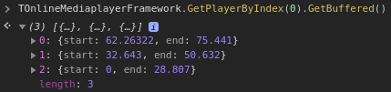

# TOnlineMediaplayer.GetBuffered(): array

Returns the player's buffered state array.

The array consists of objects that have a `start`- and `end`-property, which indicate which parts have been buffered (start second and end second).

If a user seeks the buffered array may have gaps which are not filled with video-data.

