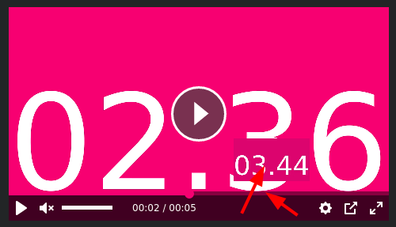
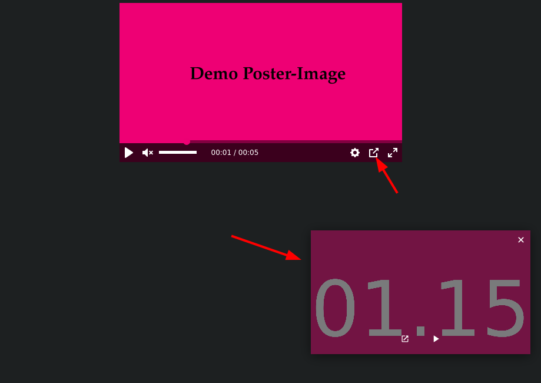

# Getting Started

Using the hosted files at github pages is probably the easiest way to get started,
you simply need to include the following links in your page.

## Example HTML and JavaScript

```html
<head>
	<link href="https://tonline-mediaplayer.github.io/assets/css/tonline-mediaplayer.css" rel="stylesheet" />
</head>

<body>
	<div class="tonline-mediaplayer fixed-ratio ratio-16-9"
		data-pip-allowed
		data-hover-preview-enabled="https://tonline-mediaplayer.github.io/assets/videos/html-examples/sample-video-240p.mp4">
		<div class="containment">
			<video
				playsinline
				muted
				poster="https://tonline-mediaplayer.github.io/assets/images/html-examples/poster.jpg"
				preload="metadata"
				data-clicktarget="video">
				<source
					data-quality="1080"
					data-label="1080p"
					src="https://tonline-mediaplayer.github.io/assets/videos/html-examples/sample-video-1080p.mp4"
					type="video/mp4">
				<source
					data-quality="720"
					data-label="720p"
					src="https://tonline-mediaplayer.github.io/assets/videos/html-examples/sample-video-720p.mp4"
					type="video/mp4">
				<source
					data-quality="240"
					data-label="240p"
					src="https://tonline-mediaplayer.github.io/assets/videos/html-examples/sample-video-240p.mp4"
					type="video/mp4">
			</video>
		</div>
	</div>
	<script src="https://tonline-mediaplayer.github.io/assets/js/tonline-mediaplayer.js"></script>
	<script>
		TOnlineMediaplayerFramework.Init();
	</script>
</body>
```
## Example React Component

```jsx
import React from 'react';
import TOnlineMediaplayerFramework from '@stroeer/tonline-mediaplayer';
import '@stroeer/tonline-mediaplayer/dist/tonline-mediaplayer.css';

export default class TOnlineMediaplayer extends React.Component {
  componentDidMount() {
    this.player = TOnlineMediaplayerFramework.New(this.playerEl).Finish();
  }

  componentWillUnmount() {
    if (this.player) {
      this.player.Dispose();
    }
  }

  render() {
    return (
      <div className="tonline-mediaplayer fixed-ratio ratio-16-9"
        ref={c => (this.playerEl = c)}
      >
        <div className="containment">
          <video
            playsInline
            preload="metadata"
            data-clicktarget="video"
            poster="https://tonline-mediaplayer.github.io/assets/images/html-examples/poster.jpg"
          >
            <source
              data-quality="1080"
              data-label="1080p"
              src="https://tonline-mediaplayer.github.io/assets/videos/html-examples/sample-video-1080p.mp4"
              type="video/mp4"
            />
            <source
              data-quality="720"
              data-label="720p"
              src="https://tonline-mediaplayer.github.io/assets/videos/html-examples/sample-video-720p.mp4"
              type="video/mp4"
            />
            <source
              data-quality="240"
              data-label="240p"
              src="https://tonline-mediaplayer.github.io/assets/videos/html-examples/sample-video-240p.mp4"
              type="video/mp4"
            />
          </video>
        </div>
      </div>
    );
  }
}
```

The order of the `<source>` tags is important.
It controls the order of the `settings -> quality` UI.
The `data-label` attribute is used for the `settings -> quality` labels text.


The first `<source>` tag is the default video file.

On mobile, you might consider putting a lower resolution video-file first.

## data-attributes

The player can be configured via data-attributes, before calling [`TOnlineMediaplayerFramework.Init()`](TOnlineMediaplayerFramework.Init.md).

 - data-fullscreen-disabled
 - data-hover-preview-enabled
 - data-pip-allowed
 - data-programmatic
 - data-vast-preroll-adtag

### data-fullscreen-disabled

If this attribute is present, the player's UI won't have a fullscreen button.
It can be enabled programmatically (via [`ToggleFullscreen()`](TOnlineVideoplayer.ToggleFullscreen.md) or [`EnterFullscreen()`](TOnlineVideoplayer.EnterFullscreen.md)) though.

### data-hover-preview-enabled

If this attribute is present, it'll show a small preview of a video frame,
when you hover the video timeline.



It uses the default video (the first video source in the html markup) as a preview.
That means, that the video could be huge, therefore you can supply a value to the attribute like so:

```
data-hover-preview-enabled="https://tonline-mediaplayer.github.io/assets/videos/html-examples/sample-video-240p.mp4">
```

This will force the player to use the smaller video (in size an resolution) for the preview.

### data-pip-allowed

Defaults to _off_.
If this attribute is present,
It'll enable the browser's native Picture-in-Picture mode (if the browser supports it).



See also: [https://w3c.github.io/picture-in-picture/](https://w3c.github.io/picture-in-picture/).

### data-programmatic

If this attribute is present, the [`TOnlineMediaplayerFramework.Init()`](TOnlineMediaplayerFramework.Init.md) method will skip the initialization of this particular player.
You can initialize the player later on with [`TOnlineMediaplayerFramework.New()`](TOnlineMediaplayerFramework.New.md).

```html
	<button id="initNowButton">Init Now</button>
	<div id="notInitializedByDefault" class="tonline-mediaplayer fixed-ratio ratio-16-9"
		data-programmatic>
		<div class="containment">
			<video
				playsinline
				muted
				poster="https://tonline-mediaplayer.github.io/assets/images/html-examples/poster.jpg"
				preload="metadata"
				data-clicktarget="video">
				<source
					data-quality="240"
					data-label="240p"
					src="https://tonline-mediaplayer.github.io/assets/videos/html-examples/sample-video-240p.mp4"
					type="video/mp4">
			</video>
		</div>
	</div>
	<script>
		TOnlineMediaplayerFramework.Init();
		document.getElementById("initNowButton").addEventListener("click", function() {
			TOnlineMediaplayerFramework.New(document.getElementById("notInitializedByDefault"));
			this.parentNode.removeChild(this);
		});
	</script>
```

### data-vast-preroll-adtag

With this attribute, you can supply a VAST preroll adtag.
You can always change or add an preroll adtag programmatically later on with [`SetVASTPrerollTag()`](TOnlineVideoplayer.SetVASTPrerollTag.md).

## HOMAD integration

For basic information about how to integrate HOMAD's Anti-Adblock solution, see [here](homad.md).

